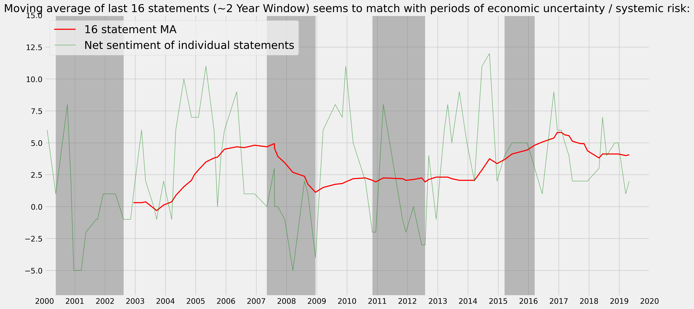
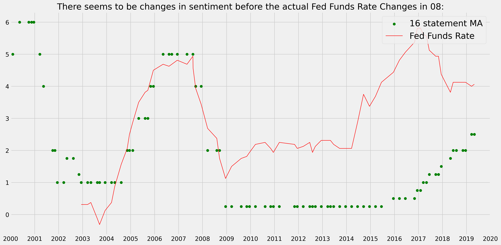
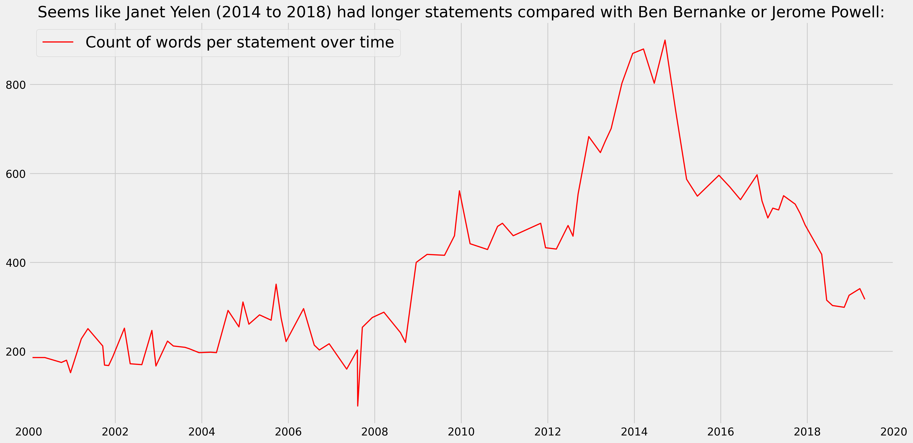

# Sentiment Analysis for FOMC Statements

## Overview

This project automates the analysis of Federal Open Market Committee statements by extracting sentiment and key rate decision information from over 500 statements spanning 20+ years. Using a combination of natural language processing (NLP) techniques with NLTK and a custom Bag-of-Words approach, the project reduces the manual lead time of sentiment analysis from hours to seconds. In addition, the project integrates FX market data to study the impact of FOMC communications on market rates.

## Key Features

- Automated ETL Pipeline: Extracts, cleans, and processes FOMC statements.
- Sentiment Extraction: Utilizes custom and NLTK-based tokenization methods to determine if the FOMC was inclined to raise, lower, or hold the federal funds rate.
- Rate Range Extraction: Parses the target rate range from the text, converting fractional values when necessary.
- Market Data Integration: Correlates sentiment trends with FX market data and other economic indicators.
- Dynamic Visualizations: Creates interactive plots (e.g., moving averages, net sentiment, word count trends) to visually represent trends over time.
- Recession Shading: Highlights periods of economic uncertainty (e.g., Dot-com bubble, Financial Crisis, European Debt Crisis, Chinese Stock Market Turbulence).

## Installation

1. Clone the Repository:

   git clone https://github.com/yourusername/Sentiment-Analysis-for-FOMC-Statements.git
   cd Sentiment-Analysis-for-FOMC-Statements

2. Create and Activate a Conda Environment
   conda create -n myenv python=3.10
   conda activate myenv

3. Install Dependencies:
   pip install -r requirements.txt

## Usage

Open the Code.ipynb notebook in VS Code or Jupyter Notebook to run and explore the analysis.

## Visualizations

    Below are some of the key visualizations generated in the project. Click on the images to view them in full size:

  Moving Average of Sentiment & Net Sentiment:

    

  Fed Funds Rate End Value & Sentiment MA:

    

  Word Count Per Statement Over Time:

    

## Project Insights
  Time Savings:
    The automated pipeline reduces analysis time from hours to seconds.

  Actionable Business Insights:
    By correlating sentiment with FX market trends, the project provides insights into how FOMC communications impact financial markets.

  Robust Methodology:
    The project employs both custom and standard NLP techniques, ensuring adaptability to different data sources and text formats.

  Interactive Dashboard
    For an interactive exploration of the data, visit our Tableau Public Dashboard or view the live interactive version on our Personal Portfolio Website.

## Conclusion
    This project demonstrates an end-to-end approach to automating sentiment analysis of FOMC statements, integrating financial market data, and producing actionable visualizations. It showcases skills in data extraction, NLP, time series analysis, and advanced visualization techniques.

